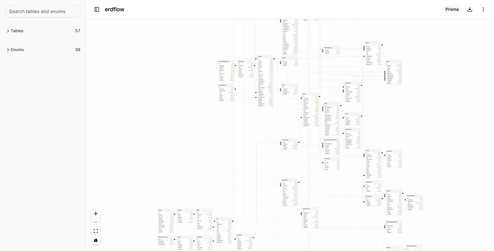
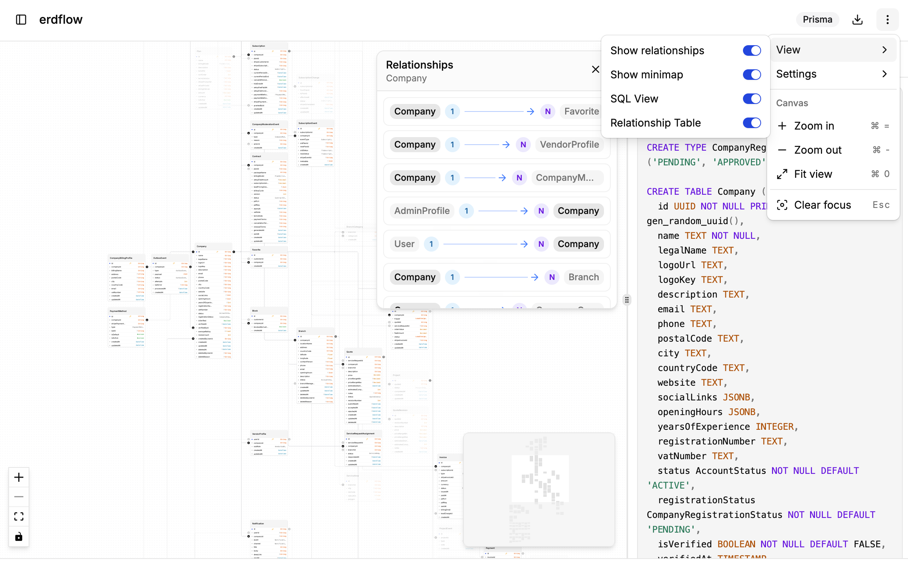

# erdFlow

Local-first schema ERDs, published **by domain**.

| Package | Install |
| --- | --- |
| **[@erdflow/prisma](./packages/prisma/README.md)** | `npx @erdflow/prisma` |
| **[@erdflow/laravel](./packages/laravel/README.md)** | `npx @erdflow/laravel` |
| `@erdflow/drizzle` (planned) | separate package later |

Shared libraries (`@erdflow/core`, layout, web, parsers) stay **private** in this monorepo — users install the domain CLI, not a universal schema library.

Publishing: [docs/deployment/deployment.md](./docs/deployment/deployment.md).

## Preview (@erdflow/prisma)





## Quick start (Prisma)

From the project that owns `schema.prisma`:

```bash
npx @erdflow/prisma
```

Or:

```bash
npx @erdflow/prisma --prisma ./prisma/schema.prisma
npx @erdflow/prisma --prisma ./prisma/schema
```

1. Detects / loads the Prisma schema (v6 or v7)
2. Opens `http://127.0.0.1:4317/` with an interactive ERD
3. Watches `.prisma` files for live updates

Agent docs ship inside the npm package: `AGENTS.md`, `llms.txt`.

## Monorepo development

```bash
pnpm install
pnpm typecheck
pnpm --filter @erdflow/core build
pnpm --filter @erdflow/prisma build
```

**Prisma docs:** [docs/development/prisma/README.md](./docs/development/prisma/README.md).

### Visualizer dev (two terminals)

**Terminal 1** — CLI:

```bash
pnpm --filter @erdflow/prisma build
node packages/prisma/dist/cli.js --no-open --prisma packages/parser-prisma/fixtures/basic.prisma
```

**Terminal 2** — Vite UI:

```bash
pnpm --filter web dev
```

Open **http://localhost:5173**.

### Tests

```bash
pnpm --filter @erdflow/prisma test
pnpm --filter @erdflow/layout test
pnpm --filter @erdflow/parser-prisma test
pnpm --filter @erdflow/web typecheck
```

## Monorepo structure

```
apps/
  web/          # Dev UI shell (Vite + shadcn)
  docs/         # Documentation
docs/           # Developer guides + deployment
packages/
  core/         # Universal Schema (private)
  prisma/       # Published as @erdflow/prisma
  laravel/      # Published as @erdflow/laravel
  web/          # Visualizer UI (private)
  layout/       # ELK.js layout (private)
  ui/           # Shared shadcn components
  parser-*/     # Schema adapters (private)
```

## Adding shadcn components

```bash
pnpm dlx shadcn@latest add button -c apps/web
```

Components land in `packages/ui/src/components`.

## Agent skills (contributors)

Skills are locked in `skills-lock.json` and installed to `.agents/skills/`. Cursor reads them via `.cursor/skills/`.

```bash
npx skills check
npx skills list
```
